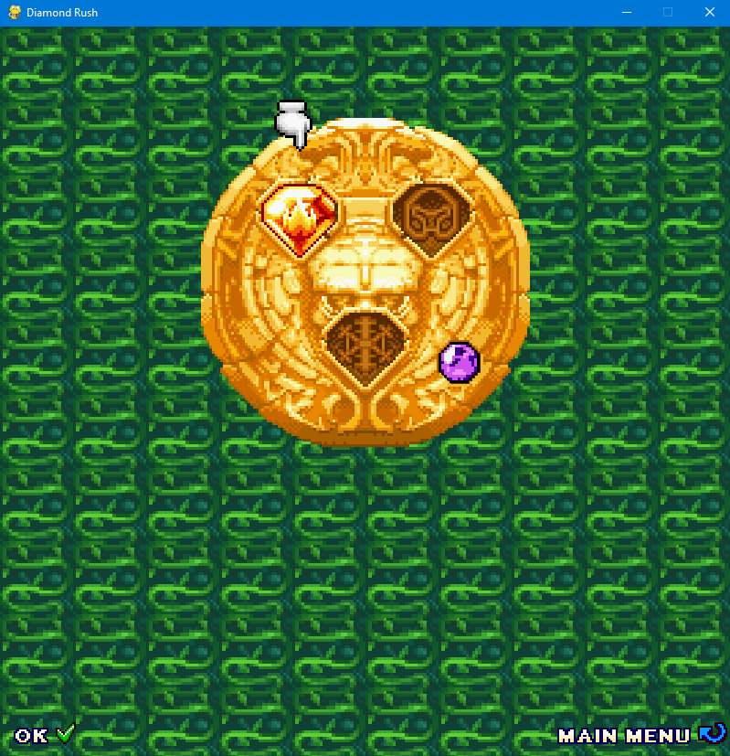
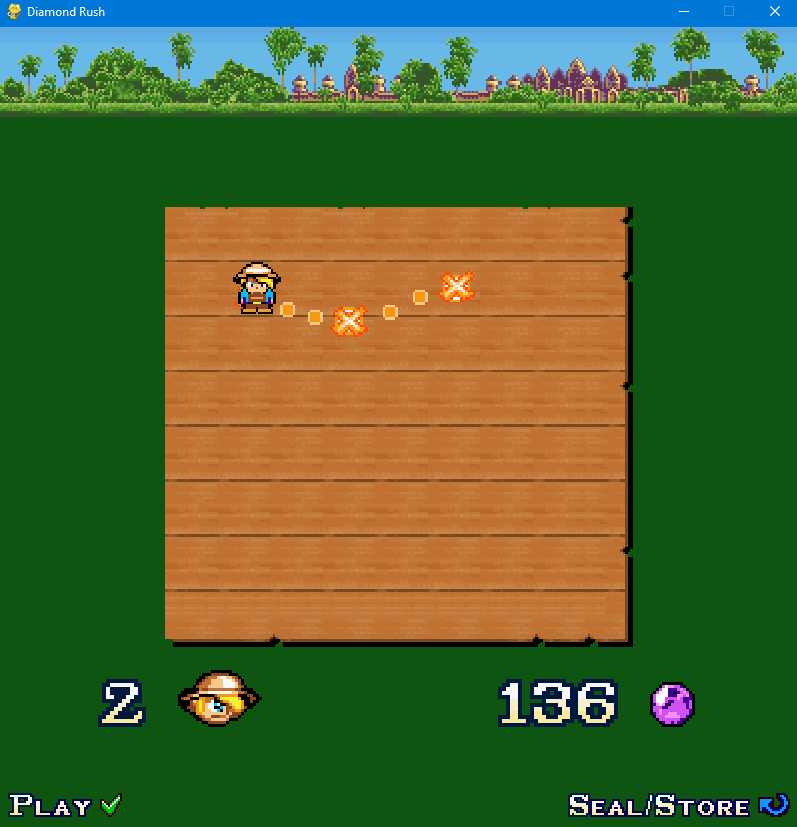
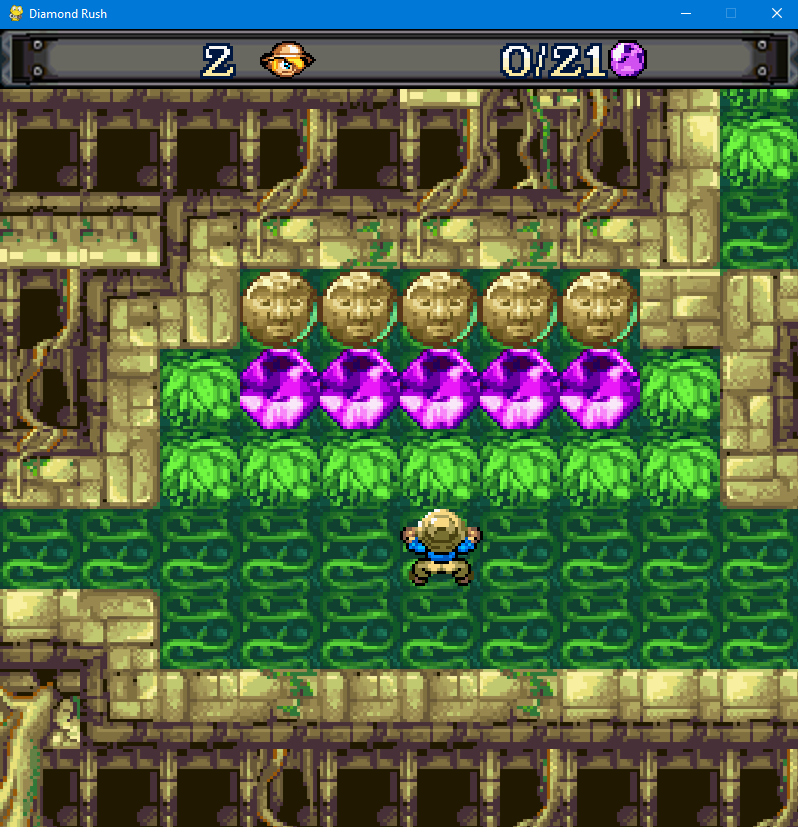
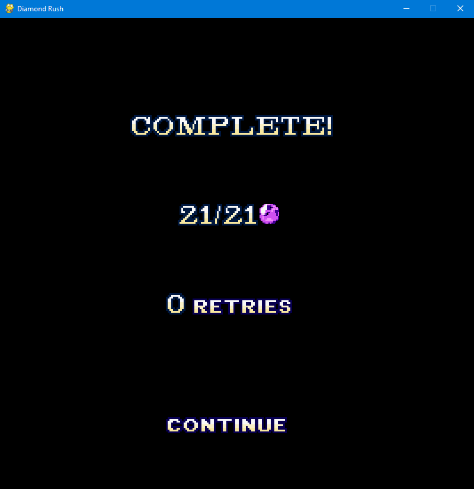

# Пояснительная записка

### Название: DiamondRush

### Автор: Бирин Вячеслав

## Введение

Ремейк игры DiamondRush 2006 (gameloft). Создана в качестве аттестационного проекта для курса по работе с библиотекой
pygame.

## Описание работы программы

### Содержимое окна

Основное меню и второстепенные стадии окна содержатся в файле window_stages.py. Само управление содержимым окна
происходит в файле window.py.

### Уровни

Уровни были созданы с помощью приложения Tiled. Они хранятся в папке maps. С ними же в этой папке находятся наборы
тайлов. Уровень представляет собой набор кубикоподобных объектов.

### Окно с итогами уровня

Это окно открывается после каждого уровня. На нём отражается счёт игрока за этот уровень и кнопка продолжить. При
нажатии на кнопку открывается карта уровней. Вся статистика хранится в папке statistics в файле stat.txt.

### Движение персонажа

Персонаж передвигается с помощью клавиш. Также он "вечно падает", т.е. всегда стремится упасть на какую либо
поверхность. Прыжок осуществляется путём подъёма персонажа на определённую высоту и удерживание его там в течение
некоторого времени.

## Скриншоты

* Основное меню

* Печать

* Выбор уровней

* Уровень

* Окно с результатами

## Зависимости

* pygame
* PyTMX
* Pillow
 
 
 
 
 
